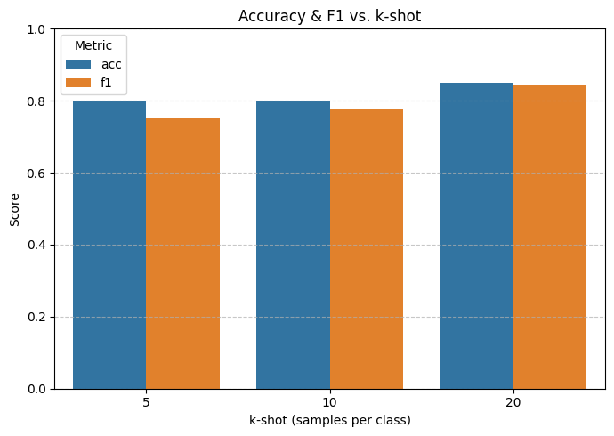

# MSP - Nhận diện Clickbait đa mô hình bằng Soft Prompt-tuning

Đây là dự án triển khai mô hình **MSP (Multimodal Soft Prompt-tuning)** cho bài toán **nhận diện tiêu đề giật gân (clickbait)** với ngôn ngữ Anh. Mô hình sử dụng dữ liệu đa phương thức gồm **văn bản**, **hình ảnh**, và **cấu trúc cú pháp**, kết hợp với cơ chế **prompt mềm** để tối ưu hiệu quả học với dữ liệu ít (few-shot).

## Bài toán

Xác định xem một bài đăng (gồm tiêu đề và hình ảnh) có phải là **clickbait** hay không.

## Kiến trúc mô hình

Mô hình MSP gồm 3 thành phần chính:

1. **Semantic Text Encoder**

   - Sử dụng: `RoBERTa-large`
   - Đầu vào: tiêu đề/bài viết dạng văn bản
   - Đầu ra: embedding ngữ nghĩa

2. **Visual Encoder**

   - Sử dụng: `CLIP` (mô hình ảnh pretrained)
   - Đầu vào: ảnh đại diện bài đăng
   - Đầu ra: embedding hình ảnh

3. **Syntactic Graph Encoder**
   - Sử dụng: `Graph Attention Network (GAT)`
   - Đầu vào: biểu đồ quan hệ cú pháp và POS tag
   - Đầu ra: embedding cú pháp

Mỗi modal được nối với một **prompt mềm (soft prompt)** rồi đi vào module **kết hợp đa modal (cross-modal fusion)**. Sau đó, phần đầu ra được đưa qua **head phân loại** để dự đoán nhãn.

## Kết quả đạt được

### Toàn bộ dữ liệu huấn luyện (full train)

- Mô hình đạt **acc=0.8283, f1=0.8273** trên tập kiểm tra đầy đủ.

### Few-shot (ít mẫu huấn luyện)

Khi huấn luyện với số mẫu ít trên mỗi lớp (k-shot), mô hình MSP vẫn giữ được hiệu suất ổn định:

| Số mẫu mỗi lớp (k-shot) | Accuracy | F1 Score |
| ----------------------- | -------- | -------- |
| 5                       | ~0.80    | ~0.75    |
| 10                      | ~0.80    | ~0.78    |
| 20                      | ~0.86    | ~0.85    |



_Biểu đồ: Kết quả trên tập test với các thiết lập few-shot_

## Cài đặt

```bash
pip install -r requirements.txt
```
